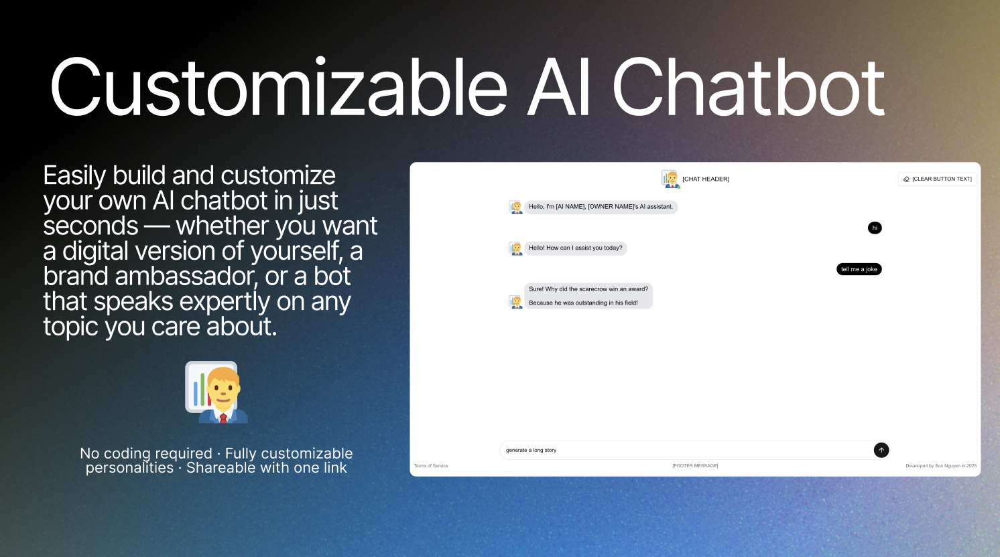
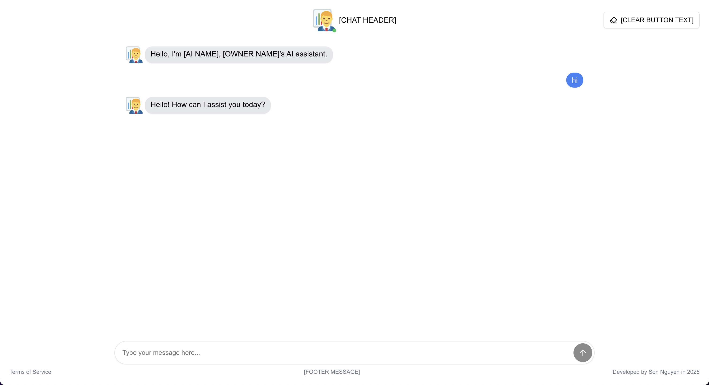
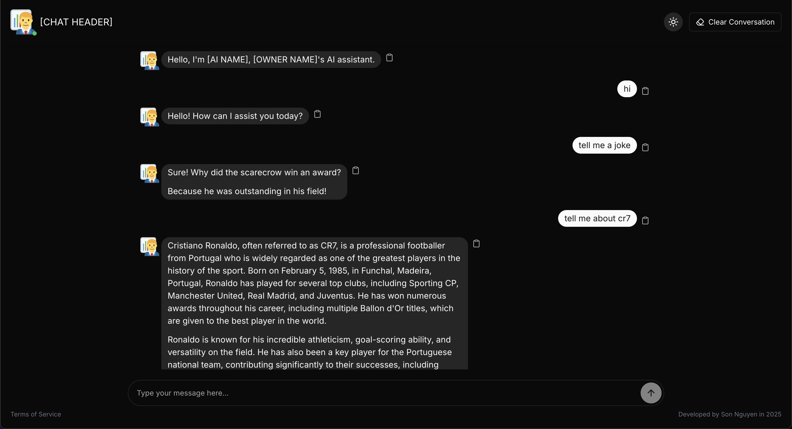

# Customizable AI Chatbot - Build Your Own Conversational AI in Minutes ⏰


A fully customizable AI chatbot built with modern web technologies. This project is designed to let you tailor every aspect of your chatbot, from its appearance and messaging to the underlying AI integrations. With support for advanced technologies such as Next.js, Tailwind CSS, RAG (Retrieval-Augmented Generation), Pinecone, and multiple AI APIs (OpenAI, Fireworks AI, Anthropic AI), this solution makes deploying your own conversational AI a breeze.

**Are you ready to build your own AI chatbot in minutes? Let's get started!** 🚀

<p align="center">
  
</p>

---

## Table of Contents

- [Introduction](#introduction)
- [Features](#features)
- [Technologies Used](#technologies-used)
- [Getting Started](#getting-started)
  - [Fork and Clone](#fork-and-clone)
  - [Service Accounts Setup](#service-accounts-setup)
  - [Environment Variables Setup](#environment-variables-setup)
  - [Local Development Setup](#local-development-setup)
- [Deployment Instructions](#deployment-instructions)
  - [Deploy on Vercel](#deploy-on-vercel)
- [Pinecone & RAG Setup](#pinecone--rag-setup)
- [Customization](#customization)
  - [UI Customization](#ui-customization)
  - [Identity Customization](#identity-customization)
  - [Intention Customization](#intention-customization)
- [Usage](#usage)
  - [Use Cases](#use-cases)
- [Contributing](#contributing)
- [Author](#author)
- [License](#license)
- [Additional Resources](#additional-resources)

For quickstart, you can ignore the detailed instructions and jump straight to the [Getting Started](#getting-started), [Deployment Instructions](#deployment-instructions), [Pinecone & RAG Setup](#pinecone--rag-setup), and [Customization](#customization) sections.

---

## Introduction

This project is a **Customizable AI Chatbot** that allows you to easily modify and deploy a conversational AI assistant. It is designed to answer a wide range of questions—including those about its creator, Son (David) Nguyen, as well as general inquiries—by integrating multiple AI APIs. The chatbot leverages RAG (Retrieval-Augmented Generation) to provide more accurate responses by managing document vectors with Pinecone.

The solution is built on **Next.js** for a robust React-based frontend, styled with **Tailwind CSS** for responsive design, and enriched with animations from **Framer Motion**. It integrates powerful AI engines such as **OpenAI**, **Fireworks AI**, and **Anthropic AI** to handle diverse conversational tasks.

**Demo Chatbot: [https://customizable-ai-chatbot.vercel.app](https://customizable-ai-chatbot.vercel.app)** 🌐.

> Note: The demo might not work when I've run out of OpenAI credits. If you notice that, please kindly notify me via email or GitHub issues and I'll try to fix it as soon as possible. Thank you for your understanding! 🙏

### User Interface

The chatbot interface is designed to be modern and user-friendly, with a clean layout and smooth animations. Users can interact with the chatbot by typing messages and receiving responses in real time. The chatbot's identity and appearance can be fully customized to match your preferences.

<p align="center">
  
</p>

<p align="center">
  
</p>

### Architecture Overview

A very high-level overview of the architecture is shown below:

<p align="center">
  
</p>

Feel free to use this customizable AI chatbot for your own projects. Some use cases include personal assistants, FAQ bots, research assistants, and more. The possibilities are endless! 🚀

---

## Features

- **Dynamic Chat Interface:** Modern, responsive UI with smooth animations.
  - **Enhanced with Streaming:** The app spits out chatbot responses as they are generated, providing a more interactive experience.
- **Advanced AI Integration:** Connects to multiple AI APIs (OpenAI, Fireworks AI, Anthropic AI) to generate rich, context-aware responses.
- **RAG & Pinecone:** Upserts document vectors into a Pinecone index for accurate retrieval and augmented generation.
  - **RAG Loader:** Comes with a tool to upload documents to Pinecone for RAG, ensuring even beginners can set up the RAG system.
  - **Source Citation:** Displays the source of the document for full transparency.
- **Easy Customization:** Modify chatbot appearance and behavior through configuration files.
- **Rapid Deployment:** Seamless integration with Vercel for fast hosting.
- **Extensible:** Additional similar technologies can be integrated as needed (shield icons above showcase major integrations).
- **Local Storage:** Persists chat history and settings across sessions, even after page refresh or reload!
- **Responsive Design:** Works on desktop, tablet, and mobile devices.
- **Clear Chat History:** Option to clear chat history and start fresh.

---

## Technologies Used

This project leverages an array of cutting-edge technologies:

- **[Next.js](https://nextjs.org/)** – The React framework for production.
  - This framework is used for building both the frontend UI and the backend API routes for handling requests.
- **[Tailwind CSS](https://tailwindcss.com/)** – Utility-first CSS framework for fast UI development.
- **[RAG (Retrieval-Augmented Generation)](https://example.com)** – Enhances responses with document context.
- **[Pinecone](https://www.pinecone.io/)** – Vector database for managing and querying document embeddings.
- **[OpenAI API](https://openai.com/api/)** – For natural language processing and generation.
- **[Fireworks AI API](https://www.fireworks.ai/)** – Additional AI capabilities.
- **[Anthropic AI API](https://www.anthropic.com/)** – Advanced conversational AI.
- **[Framer Motion](https://www.framer.com/motion/)** – For smooth animations.
- **[Vercel](https://vercel.com/)** – For easy deployment and hosting.

Each of these technologies is represented with a shield icon at the top of this README for quick visual reference.

---

## Getting Started

### Fork and Clone

1. **Fork the Repository:**  
   Click the **Fork** button in the top-right corner of the GitHub page to create your own copy of this repository.

2. **Clone Your Fork:**  
   Open your terminal and run: (Replace `your-username` with your GitHub username)
   ```bash
   git clone https://github.com/hoangsonww/Customizable-AI-Chatbot.git
   cd Customizable-AI-Chatbot
   ```

### Service Accounts Setup

**IMPORTANT**: Before starting the project, you need to set up accounts with the following services to obtain API keys. This is crucial for the chatbot to function correctly:

1. **OpenAI API Key:**  
   Sign up at [OpenAI](https://openai.com/) and create an API key. Be sure that your account balance is at least $5 to avoid any issues.
2. **Fireworks AI API Key:**  
   Sign up at [Fireworks AI](https://www.fireworks.ai/) and create an API key.
3. **Anthropic AI API Key:**  
   Sign up at [Anthropic AI](https://www.anthropic.com/) and create an API key.
4. **Pinecone API Key:**  
   Sign up at [Pinecone](https://www.pinecone.io/) and create an API key. Make sure to create a new index in your Pinecone account.
5. **RAG by Ringel:**  
   Visit [RAG by Ringel](https://rag.ringel.ai/) and create an account. This tool will help you upload documents to Pinecone for RAG. Make sure to create a new project and enter your Pinecone API key and index name (exactly as you created it in Pinecone) in the project settings.

### Environment Variables Setup

Create a `.env` file in the root directory of your project and add the following keys:

```env
OPENAI_API_KEY=your_openai_api_key
ANTHROPIC_API_KEY=your_anthropic_api_key
FIREWORKS_API_KEY=your_fireworks_api_key
PINECONE_API_KEY=your_pinecone_api_key
```

Replace the placeholder values with your actual API keys. Refer to the `.env.template` file for more information.

### Local Development Setup

1. **Install Dependencies:**  
   Ensure you have [Node.js](https://nodejs.org/) installed. Then, install the project dependencies by running:

   ```bash
   npm install
   ```

   or, if you prefer Yarn:

   ```bash
   yarn install
   ```

2. **Run the Development Server:**  
   Start the local development server with:
   ```bash
   npm run dev
   ```
   Your application will be available at [http://localhost:3000](http://localhost:3000).

> Note: Before running the project, ensure that you have set up the environment variables correctly in the `.env` file. The application will not work without these keys.

---

## Deployment Instructions

### Deploy on Vercel

1. **Create a Vercel Account:**  
   Visit [Vercel](https://vercel.com) and sign up for an account if you haven't already.

2. **Connect Your Git Repository:**

   - Log in to Vercel and click on **New Project**.
   - Select your forked repository from your GitHub account.
   - Follow the prompts to connect your Git repository with Vercel.

3. **Configure Environment Variables:**  
   In your Vercel project settings, add the same environment variables from your `.env` file:

   - `OPENAI_API_KEY`
   - `ANTHROPIC_API_KEY`
   - `FIREWORKS_API_KEY`
   - `PINECONE_API_KEY`

4. **Deploy the Project:**  
   Click **Deploy**. Vercel will build and deploy your project automatically. Your chatbot will then be live on a Vercel-provided URL.

---

## Pinecone & RAG Setup

1. **Pinecone Account & Index:**

   - Visit [Pinecone](https://www.pinecone.io) and create an account.
   - Once logged in, create a new index. **Make sure to remember the exact index name.**

2. **RAG Setup:**

   - Go to [RAG by Ringel](https://rag.ringel.ai/).
     - _**Credits**: Dr. Ringel at UNC-Chapel Hill for providing this tool._
   - Create an account and start a **new project**.
   - Add your **Pinecone API key** in the project settings.
   - When prompted, enter the **Pinecone index name exactly as you created it in Pinecone**.
     - Note: The index name should be `my-ai` by default, but you can change it to whatever you prefer. Just make sure to change it in `configurations/pinecone.ts` as well.
   - Set the **source URL to a single space** (if there isn’t an applicable URL).
   - Leave all other settings unchanged.

3. **Document Preparation:**

   - Convert your documents to **Markdown** or **TXT** format if necessary.
   - Use the [RAG by Ringel](https://rag.ringel.ai/) interface to upload your documents to Pinecone. This will create document vectors for retrieval.
     - Credits to Dr. Ringel at UNC-Chapel Hill for providing this tool!
   - The documents should be any relevant text data that you want the chatbot to reference during interactions.
   - An example document could be a list of FAQs or a collection of articles about you, so that the chatbot can provide accurate responses about you.
   - RAG will use these documents to upsert Pinecone vectors, ensuring accurate retrieval during chat interactions.

> **Note:** Be sure that your Pinecone index and RAG project are correctly set up and linked to your chatbot. This will ensure that the chatbot can provide accurate and context-aware responses.

---

## Customization

This project is highly customizable. Below are the main configuration files that you can modify:

### UI Customization

**File:** `configuration/ui.ts`  
Customize the chatbot's UI text and settings:

```tsx
import { AI_NAME, OWNER_NAME } from "@/configuration/identity";

export const CHAT_HEADER: string = `[CHAT HEADER]`;
export const MESSAGE_PLACEHOLDER: string = `[MESSAGE PLACEHOLDER]`;
export const FOOTER_MESSAGE: string = `[FOOTER MESSAGE]`;
export const CLEAR_BUTTON_TEXT: string = `[CLEAR BUTTON TEXT]`;
export const PAGE_TITLE: string = `[PAGE TITLE]`;
export const PAGE_DESCRIPTION: string = `Chat with ${AI_NAME}, ${OWNER_NAME}'s AI assistant.`;

export const EMPTY_CITATION_MESSAGE: string = "Unspecified source";
```

Adjust the placeholder text as needed to match your desired user interface.

### Identity Customization

**File:** `configuration/identity.ts`  
Set up the chatbot’s identity and the owner's details:

```tsx
export const OWNER_NAME: string = `Son (David) Nguyen`;
export const OWNER_DESCRIPTION: string = `A results-driven software engineer with expertise in data analytics, full-stack development, and technical consulting.`;

export const AI_NAME: string = `Lumina`;
export const AI_TONE: string = `Friendly and Professional`;
export const AI_ROLE: string = `AI Personal Assistant for Son (David) Nguyen`;
```

Modify these values if you wish to change the chatbot’s persona or its association.

### Intention Customization

For advanced customization of the chatbot’s behavior and system instructions, please review and modify the `intention.ts` file. This file contains core instructions that define the chatbot’s responses and operational logic. Adjust the system prompt and behavior settings to better align with your desired use case.

### Environment Configuration

**File:** `.env`  
Ensure that your `.env` file in the root directory contains the following keys:

```env
OPENAI_API_KEY=your_openai_api_key
ANTHROPIC_API_KEY=your_anthropic_api_key
FIREWORKS_API_KEY=your_fireworks_api_key
PINECONE_API_KEY=your_pinecone_api_key
```

Replace each placeholder with the respective API key provided by the service.

### Chatbot Avatar Customization

This is optional, but you can customize the chatbot's avatar by replacing the image file in the `public` directory. The default avatar is located at `public/ai-logo.png`. You can replace it with your own image file, ensuring that the new file has the same name and format.

Additionally, you can customize the web app's favicon by replacing the file at `app/favicon.ico`. This will change the icon that appears in the browser tab when users visit your chatbot.

> Note: The recommended image size for the avatar is 512x512 pixels, and the recommended size for the favicon is 32x32 pixels. An image with a transparent background is preferred for both.

_**That's it! You have now successfully customized your AI chatbot to match your preferences. Feel free to explore additional customization options as needed.**_

---

## Usage

Once deployed, your AI chatbot will be available for interaction. Users can engage with the bot through the chat interface, and any updates made to the configuration files will reflect on the next deployment or rebuild. The chatbot is designed to handle questions related to its creator, Son (David) Nguyen, as well as general inquiries about various topics.

Key interactions include:

- **Conversational AI:** Answering questions with context from Pinecone and RAG.
- **Custom Responses:** Leveraging multiple AI APIs for tailored answers.
- **Dynamic Configuration:** Instant changes via editing `ui.ts`, `identity.ts`, and `intention.ts`.

Alternatively, you can deploy your AI locally for testing and development purposes. The chatbot will be accessible at [http://localhost:3000](http://localhost:3000) once the development server is running.

The instructions for running the development server are detailed in the [Local Development Setup](#local-development-setup) section above.

### Use Cases

This AI chatbot can be used for a variety of purposes, including:

- **Personal AI Assistant:** Providing information about the creator, Son (David) Nguyen.
- **FAQ Chatbot:** Answering common questions about a specific topic.
- **Research Assistant:** Retrieving and summarizing information from documents.
- **Educational Tool:** Teaching users about a particular subject or field.
- **Documentation Bot:** Providing help and guidance on a product or service.
- **Customer Support:** Assisting users with inquiries and troubleshooting.
- **Interactive Chatbot:** Engaging users in conversation and entertainment.
- **AI Showcase:** Demonstrating the capabilities of modern conversational AI.

And many more! The chatbot is highly adaptable and can be tailored to suit a wide range of use cases.

---

## Contributing

Contributions to enhance this project are welcome. To contribute:

1. **Fork the Repository:** Create your own copy on GitHub.
2. **Create a New Branch:** Work on your feature or fix in a new branch.
3. **Commit Changes:** Follow the established coding standards.
4. **Submit a Pull Request:** Provide detailed information about your changes.
5. **Documentation:** Update README and inline comments as necessary.

---

## Author

If you have any questions or feedback, feel free to reach out to me at:

- **Son (David) Nguyen** – [GitHub](https://github.com/hoangsonww/)
- **Website:** [Personal Website](https://sonnguyenhoang.com/)
- **LinkedIn:** [LinkedIn](https://www.linkedin.com/in/hoangsonw/)
- **Personal Blog:** [David's Blog](https://devverse.vercel.app/)
- **Personal AI Assistant:** [Lumina AI](https://lumina-david.vercel.app/)
- **Email:** [Email](mailto:hoangson091104@gmail.com)

Additionally, this chatbot was inspired by Dr. Ringel's work and chatbot at UNC-Chapel Hill. You can find more about his work at [Dr. Ringel's Website](https://www.ringel.ai/).

---

## License

This project is licensed under the [MIT License](LICENSE). Please review the license file for more details.

**NOTE:** This project is for educational purposes only. It is not intended for commercial use or distribution. Additionally,
you must keep the footer credit intact to respect the original creator's work.

By using or contributing to this project, you agree to abide by the terms of the license.

---

## Additional Resources

For more information on the technologies and APIs used in this project, check out the following resources:

- **Next.js Documentation:** [Next.js Docs](https://nextjs.org/docs)
- **Tailwind CSS Documentation:** [Tailwind CSS Docs](https://tailwindcss.com/docs)
- **Pinecone Documentation:** [Pinecone Docs](https://docs.pinecone.io/)
- **OpenAI API Documentation:** [OpenAI Docs](https://openai.com/api/)
- **Fireworks AI API Documentation:** [Fireworks AI](https://www.fireworks.ai/)
- **Anthropic AI API Documentation:** [Anthropic AI](https://www.anthropic.com/)
- **Framer Motion Documentation:** [Framer Motion](https://www.framer.com/motion/)
- **Vercel Documentation:** [Vercel Docs](https://vercel.com/docs)

---

Happy coding! 🚀 Thank you for using and contributing to this project.

[⬆️ Back to Top](#customizable-ai-chatbot---build-your-own-conversational-ai-in-minutes-)
